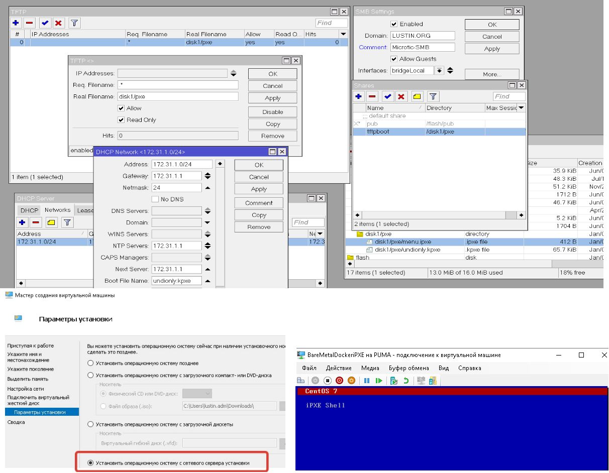

## Пример сборки своего iPXE загрузчика

ключевая хитрость - образа операционных систем скачиваются напрямую с репозиториев, минуя локальное хранилище.

## Порядок использования

используем Ubuntu или WSL2-Ubuntu

### 0 - Подготовка станции DevOps инженера

> DevOps инженером может быть и 1С разработчик ;-) - это же просто роль

* ` sudo apt install build-essential liblzma5 mkisofs perl xz-utils mtools liblzma-dev git`
* `git clone https://github.com/aliczin/ipxe-demo`
* `git submodule update --init --recursive`

### 1 - сборка своего меню

* песобираем наш загрузчик `01-build.sh`
* подготавливаем `02-prepare.sh`

Остается только закинуть на TFTP сервер и добавить настройки DHCP Server - это уже к админам сети ;-)

вообще-то можно еще Rancher-OS устаавливать - но это чуть-позже на основе вот такого https://github.com/MayankTahil/rancheros-pxe-bootstrap

